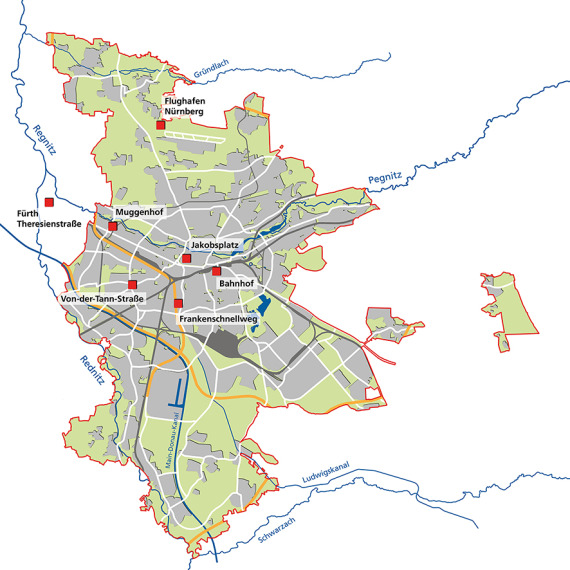
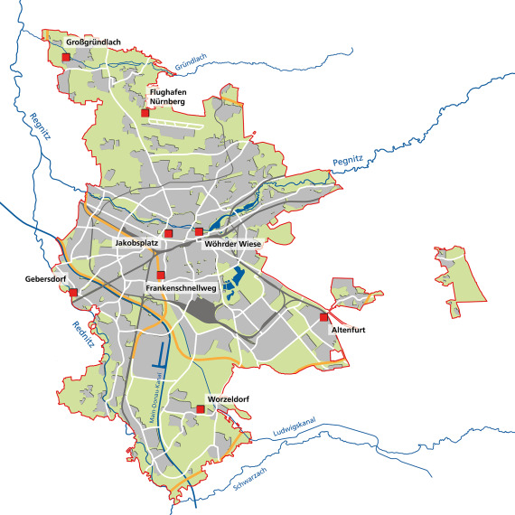

# Nürnberg Umweltdaten (Home Assistant)

Custom integration for Home Assistant that reads the public environmental data
published by the **City of Nuremberg** (Stadtentwässerung & Umweltanalytik
Nürnberg, SUN) via its JSON microservice
`https://microservices.nuernberg.de/umweltdaten/`.

## Features

- **Station picker:** during setup you choose one of the official measuring
  stations (Flughafen, Muggenhof, Frankenschnellweg, …). Several stations can
  be added independently.
- **One device per station** with the station name as device name.
- **Dynamic sensors:** only the values that the selected station actually
  reports are created. Fields that are `null` for a station are skipped, so no
  "unknown" sensors clutter your setup. A Flughafen entry therefore creates
  air-quality *and* weather sensors, while a pure weather station only exposes
  weather sensors.
- Polled every 30 minutes for air/weather stations and every 15 minutes for
  water stations by default. The interval can be tuned per station in the
  integration's options (slider, 5–1440 minutes). Changing it reloads the
  station automatically. No API key required.

## Covered measurements

| Category | Values |
|----------|--------|
| Außenluft | NO, NO₂, NOx, SO₂, O₃, O₃-8h, CO, Benzol, Toluol, Methan, THC, NMHC, PM10, PM2.5 (+ raw) |
| Wetterdaten | Lufttemperatur, Luftfeuchtigkeit, Luftdruck, Windgeschwindigkeit, Max.-Wind, Windrichtung, Globale Strahlung, Niederschlag, UV-Index |
| Fließgewässer | Wassertemperatur, pH, Leitfähigkeit, Sauerstoff, Trübung, Chlorophyll, Phosphat, Ammonium, Nitrat |

Each sensor carries `last_measured` (the station's `date_entry`) and
`station_code` as extra attributes.

## Stations & measurements

Die folgenden Lagepläne werden von der **Stadt Nürnberg** (Stadtentwässerung
und Umweltanalytik Nürnberg) veröffentlicht und zeigen die autoritativen
Standorte der Messstationen. Quelle:
[nuernberg.de/internet/umweltdaten](https://www.nuernberg.de/internet/umweltdaten/).

<table align="center">
  <tr>
    <td align="center"> Luftmessstationen (SUN &amp; LfU)</td>
    <td align="center"> Wetter-/Niederschlagsstationen</td>
  </tr>
</table>

The table below shows which values each station currently provides. The
integration creates exactly these sensors dynamically – `null` fields are
skipped, so no "unknown" entities appear.

| Code | Station | Kategorie | Messwerte |
|------|---------|-----------|-----------|
| FLH | Flughafen Nürnberg | Luft + Wetter | NO, NO₂, O₃, CO, Benzol, PM10, PM2,5 · Temp, Feuchte, Druck, Wind, Wind max, Windricht., Globalstr., Niederschlag, UV |
| FSW | Frankenschnellweg | Luft + Wetter | NO, NO₂, PM10, PM2,5 · Temp, Feuchte, Wind, Wind max, Windricht., Niederschlag |
| JKP | Jakobsplatz | Luft + Wetter | NO, NO₂, O₃, PM10, PM2,5 · Temp, Feuchte, Niederschlag |
| MGH | Muggenhof (SUN) | Luft | NO, NO₂, CO |
| MGHLFU | Muggenhof (LfU) | Luft | NO₂, O₃ |
| BHF | Bahnhof | Luft | NO₂ |
| VTS | Von-der-Tann-Straße | Luft | NO₂, CO, PM10 |
| FTS | Fürth Theresienstraße | Luft | PM10 |
| ATF | Altenfurt | Wetter | Niederschlag |
| GBD | Gebersdorf | Wetter | Niederschlag |
| WW | Wöhrder Wiese | Wetter | Niederschlag |
| WD | Worzeldorf | Wetter | Niederschlag |
| GGL | Großgründlach | Wetter | Niederschlag |
| HD | Hüttendorf | Fließgewässer | Wassertemp., Leitf., O₂, Trübung, Nitrat *(Sanierung)* |
| NM | Neumühle | Fließgewässer | Wassertemp., pH, Leitf., O₂, Trübung, Ammonium, Nitrat *(Sanierung)* |
| THB | Theodor-Heuss-Brücke | Fließgewässer | – *(Sanierung, aktuell keine nutzbaren Werte)* |

> **Hinweis:** Die Fließgewässer-Stationen *Hüttendorf*, *Neumühle* und
> *Theodor-Heuss-Brücke* werden bis ca. November 2026 erneuert und liefern
> teils veraltete bzw. keine Werte. *Muggenhof (SUN)* liegt in der
> Wissmannstraße – praktisch vor der Tür, wenn du dort wohnst.

## Installation (HACS)

1. Copy this repository into HACS as a custom repository
   (**Settings → Custom repositories**, category *Integration*).
2. Install **Nürnberg Umweltdaten**.
3. Restart Home Assistant.
4. Add the integration via **Settings → Devices & Services → Add integration**
   and select *Nürnberg Umweltdaten*. Pick a station – the sensors appear
   automatically.
5. Optionally adjust the polling interval via **Configure** on the integration
   card (recommended: stay near the defaults, since faster polling only
   re-fetches identical values).

## Notes

- The official portal states that data younger than seven days is still
  unverified.
- The stations *Theodor-Heuss-Brücke*, *Neumühle* and *Hüttendorf* are being
  refurbished until approximately November 2026 and may deliver stale values.
- The underlying API is undocumented; it is the same one used by the city's
  public web frontend.

## Data source & attribution

All measurement data is provided by the **City of Nuremberg** – specifically
the *Stadtentwässerung und Umweltanalytik Nürnberg (SUN)* – via the public
website [nuernberg.de/internet/umweltdaten/](https://www.nuernberg.de/internet/umweltdaten/).
This integration consumes the same undocumented JSON microservice that powers
that website. There is no formal API contract, API key or rate-limit agreement;
please use it fairly and do not poll more aggressively than necessary. The
data itself is not covered by this repository's license and remains the property
of the City of Nuremberg.

## License

This integration is licensed under the [MIT License](LICENSE).

